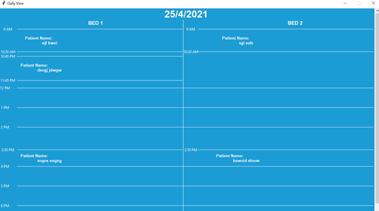
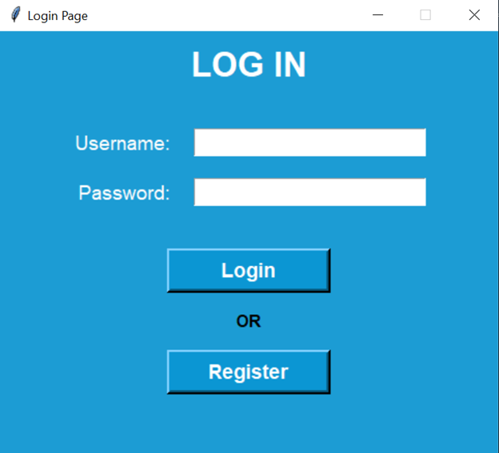
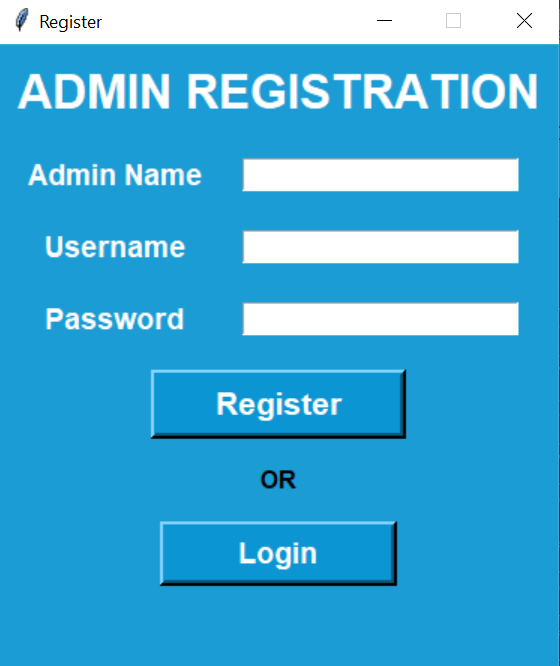
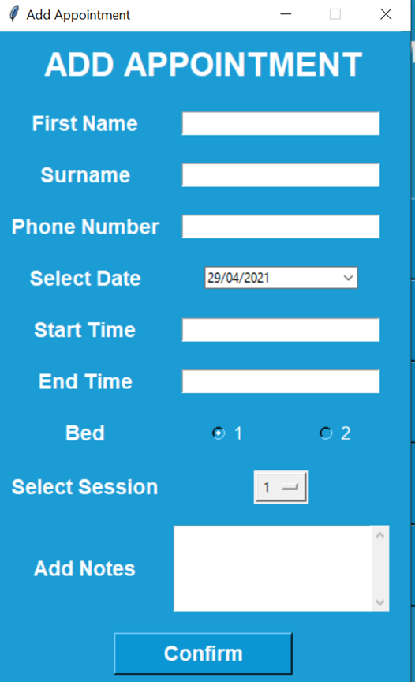
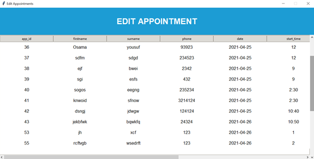
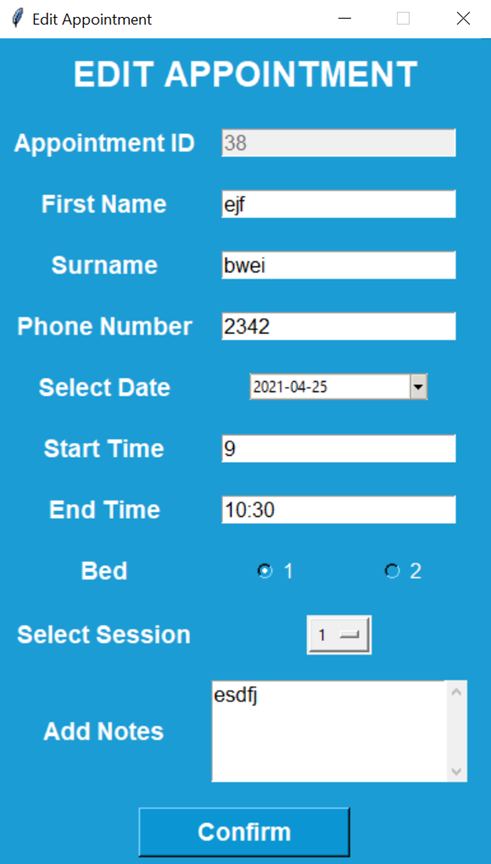
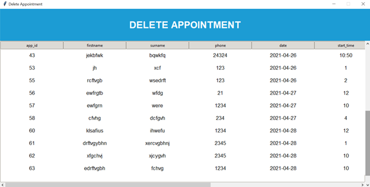

# Appointment Booking System with Python
### Installation
1) **Install Python** from https://www.python.org/downloads/
2) **Install Dependencies**
Open cmd in the folder Snipping Tool and run this command
```ruby
pip install -r requirements.txt
```
3) After installing the dependencies, run the py file **OR** write this command in cmd and enter
```ruby
python main.py
```
### Information
This System is developed using **Python**. Following are the libraries used:
1) **Tkinter**

***Following are the characteristics of the system:***<br>
◉) This system allows you to add, update, and delete appointments.<br>
◉) The admin has to login first to use the functionalities or has to Register first.<br>
◉) The calendar widget is made to show all the appointments on a date with the patients name written.<br>
◉) Each day there can eb multiple appointments.<br>
◉) At a time there can be two appointments. It is shown on each daily view.<br>
◉) All the appointment and admin data is saved in the sqlite database.<br>

The System is developed by Muhammad Osama [(Github)](https://github.com/Osama710) [(LinkedIn)](https://www.linkedin.com/in/osama-yousuf-6a1952177/)

## Screenshots<br>








